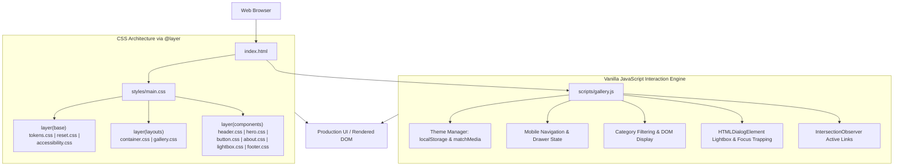
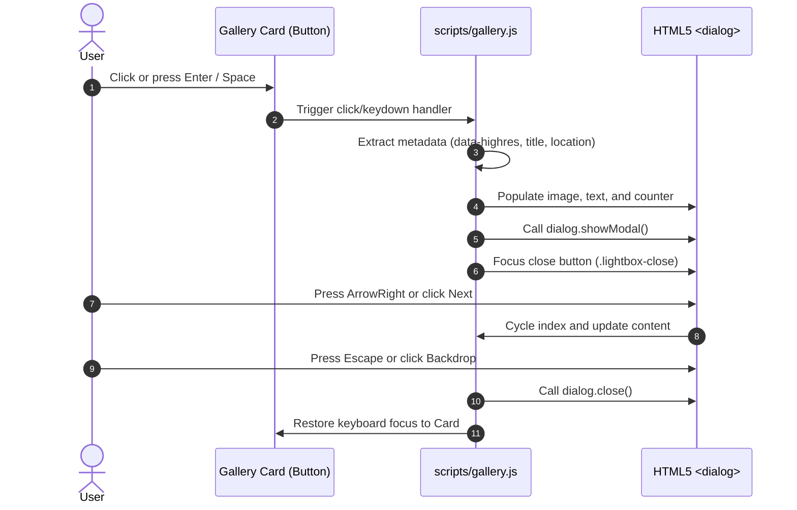

# Lumina — Architectural Photo Gallery Wall

[](https://developer.mozilla.org/)
[-7952B3?style=flat-square&logo=css3&logoColor=white)](https://developer.mozilla.org/en-US/docs/Web/CSS/@layer)
[](https://developer.mozilla.org/en-US/docs/Web/CSS/CSS_Grid_Layout)
[](https://www.w3.org/WAI/standards-guidelines/wcag/)
[](https://github.com/)
[](LICENSE)

> **Lumina** is a production-grade, editorial architectural photography gallery engineered with modern **CSS Grid Level 2**, **CSS Cascade Layers (`@layer`)**, **Design Tokens (`clamp()`)**, and native web standards.
> 
> **Zero build steps. Zero external runtime dependencies. Zero CSS frameworks.** Built strictly with native semantic HTML5, modern modular CSS3, and lightweight vanilla JavaScript.

---

## Table of Contents

1. [Project Overview](#project-overview)
2. [Features](#features)
3. [Technology Stack](#technology-stack)
4. [Requirements & Prerequisites](#requirements--prerequisites)
5. [Repository Structure](#repository-structure)
6. [System Architecture](#system-architecture)
7. [CSS Architecture & Cascade Layers](#css-architecture--cascade-layers)
8. [Design Tokens System](#design-tokens-system)
9. [Component & Layout Responsibilities](#component--layout-responsibilities)
10. [JavaScript Architecture & Interaction Engine](#javascript-architecture--interaction-engine)
11. [Data & User Interaction Flows](#data--user-interaction-flows)
12. [Accessibility Architecture](#accessibility-architecture)
13. [Responsive Layout Strategy](#responsive-layout-strategy)
14. [Local Development Guide](#local-development-guide)
15. [How to Modify the Project](#how-to-modify-the-project)
16. [Testing & Quality Assurance Checklist](#testing--quality-assurance-checklist)
17. [Troubleshooting Guide](#troubleshooting-guide)
18. [Performance & Core Web Vitals](#performance--core-web-vitals)
19. [Security Considerations](#security-considerations)
20. [Browser Compatibility](#browser-compatibility)
21. [New Developer Onboarding](#new-developer-onboarding)
22. [Known Limitations](#known-limitations)
23. [Future Improvements](#future-improvements)
24. [License](#license)

---

## Project Overview

Modern web applications often rely on heavy external JavaScript libraries (such as Masonry, Isotope, or Packery) to build asymmetrical and masonry-style image galleries. These libraries increase bundle sizes, cause layout thrashing, degrade Cumulative Layout Shift (CLS), and introduce accessibility barriers for assistive devices.

**Lumina** solves this by leveraging modern native platform standards:
- **CSS Grid Level 2** provides deterministic two-dimensional track positioning and self-organizing dense packing (`grid-auto-flow: dense`).
- **CSS Cascade Layers (`@layer`)** manage specificity deterministically without selector hacks or `!important`.
- **CSS Mathematical Functions (`clamp()`)** provide fluid typography and spatial scaling across viewports without rigid breakpoint jumps.
- **Native HTML5 `<dialog>`** delivers a fully accessible modal lightbox with zero external UI runtimes.
- **Vanilla JavaScript interaction engine** handles theme persistence, mobile menu toggling, category filtering, and accessible dialog trapping in under 280 lines of clean code.

---

## Features

- **Magazine-Style Explicit Editorial Grid:** A deterministic 4-column, 2-row editorial grid with asymmetrical visual hierarchy.
- **Self-Organizing Dense Implicit Grid:** Auto-flowing masonry layout with gap back-filling via native `grid-auto-flow: dense`.
- **Intermediate Tablet Grid:** Smooth 2-column tablet layout (`640px`–`1023px`) eliminating abrupt mobile drops.
- **Accessible Native Lightbox Modal (`<dialog>`):** Native focus trapping, backdrop blur, `Escape` key dismiss, and cyclic `Left`/`Right` arrow navigation.
- **Interactive Category Filtering:** Real-time gallery filtering (`All Works`, `Architecture`, `Interior`, `Urban`, `Minimal`) updating DOM state and ARIA attributes.
- **Dual-Mode Theme Engine:** System preference detection (`prefers-color-scheme`) paired with manual toggle override and `localStorage` persistence.
- **Fluid Design Tokens:** Proportional scaling for typography and spacing via CSS `clamp()` from mobile to 4K ultra-wide screens.
- **Architectural Hero Visual Grid:** Abstract 2D grid visual composition with coordinates and micro-indicators.
- **Touchscreen Adaptations:** Automatic caption visibility on non-hover devices via `@media (hover: none)`.
- **Full WCAG 2.1 AA Compliance:** Skip-to-content link, high-contrast `:focus-visible` outlines, semantic landmarks, and full `@media (prefers-reduced-motion: reduce)` fallbacks.
- **SEO & Social Graph Optimization:** Complete Open Graph tags, Twitter Cards, SVG Favicon, and Schema.org `ImageGallery` JSON-LD structured data.

---

## Technology Stack

| Layer | Technology | Specification / Standard |
| :--- | :--- | :--- |
| **Markup** | HTML5 | Semantic HTML Living Standard (`<header>`, `<nav>`, `<main>`, `<section>`, `<dialog>`, `<footer>`) |
| **Styles** | Vanilla CSS3 | Modern CSS specifications: `@layer`, CSS Grid Level 2, CSS Math (`clamp()`), Native Nesting, Custom Properties |
| **Scripting** | Vanilla JavaScript | Modern ECMAScript (ES2022+): `IntersectionObserver`, HTMLDialogElement API, `matchMedia`, `localStorage` |
| **Fonts** | Google Fonts | Inter (weights: 400, 500, 600, 700, 800, 900) with TLS `preconnect` |
| **Assets** | Unsplash CDN | Curated, high-availability architectural photography delivered over HTTPS |
| **Icons** | Inline SVG | Scalable vector graphics embedded directly in markup and CSS (zero external icon font files) |

---

## Requirements & Prerequisites

- **No build tools required:** No Node.js, npm, webpack, Vite, or bundler is necessary to run the project.
- **Runtime:** Any modern browser supporting CSS Grid Level 2, Cascade Layers (`@layer`), and the HTMLDialogElement API:
  - Google Chrome 99+
  - Mozilla Firefox 97+
  - Apple Safari 15.4+
  - Microsoft Edge 99+

---

## Repository Structure

```text
Photo-Gallery-Wall/
│
├── index.html                     # Semantic HTML5 root document, metadata, and landmarks
├── README.md                      # Software engineering documentation & architectural reference
│
├── scripts/
│   └── gallery.js                 # Zero-dependency interaction engine (lightbox, theme, filters)
│
└── styles/
    ├── main.css                   # Entry stylesheet orchestrating CSS @layer hierarchy
    │
    ├── base/
    │   ├── tokens.css             # Design tokens: fluid clamp(), dark mode palette, elevation
    │   ├── reset.css              # CSS reset, smooth scroll, form & dialog normalization
    │   └── accessibility.css      # Skip link, .sr-only utility, focus rings, reduced motion
    │
    ├── layouts/
    │   ├── container.css          # Fluid container width and horizontal padding rules
    │   └── gallery.css            # Explicit (editorial) & implicit (auto-flow) grid engines
    │
    └── components/
        ├── header.css             # Sticky glassmorphic nav & responsive mobile menu drawer
        ├── hero.css               # Architectural hero section & modernist 2D visual grid
        ├── button.css             # Primary and outline button variants with micro-interactions
        ├── about.css              # Architectural philosophy and web standards cards
        ├── lightbox.css           # Native HTML5 <dialog> modal viewer stylesheet
        └── footer.css             # 3-column responsive footer & back-to-top action
```

---

## System Architecture



---

## CSS Architecture & Cascade Layers

Lumina organizes all styles into three deterministic specificity layers using native CSS `@layer` in `styles/main.css`:

```css
@layer base, layouts, components;

/* Base Layer */
@import 'base/tokens.css' layer(base);
@import 'base/reset.css' layer(base);
@import 'base/accessibility.css' layer(base);

/* Layouts Layer */
@import 'layouts/container.css' layer(layouts);
@import 'layouts/gallery.css' layer(layouts);

/* Components Layer */
@import 'components/button.css' layer(components);
@import 'components/header.css' layer(components);
@import 'components/hero.css' layer(components);
@import 'components/about.css' layer(components);
@import 'components/lightbox.css' layer(components);
@import 'components/footer.css' layer(components);
```

### Why Cascade Layers?
1. **Deterministic Specificity:** Components (`layer(components)`) always override Layouts (`layer(layouts)`), and Layouts always override Base rules (`layer(base)`), regardless of selector complexity or order of appearance.
2. **Zero `!important` Hacks:** Eliminates specificity wars common in large component codebases.
3. **Strict Separation of Concerns:** Resets and variables live exclusively in base layers, track layouts in layout layers, and visual skins in component layers.

---

## Design Tokens System

Defined in `styles/base/tokens.css`, tokens leverage CSS custom properties and math functions:

### 1. Fluid Typography
```css
--text-xs: clamp(0.72rem, 0.9vw, 0.82rem);
--text-sm: clamp(0.85rem, 1.2vw, 0.95rem);
--text-base: clamp(1rem, 1.6vw, 1.125rem);
--text-md: clamp(1.2rem, 2vw, 1.45rem);
--text-lg: clamp(1.5rem, 3vw, 2.15rem);
--text-xl: clamp(2.35rem, 5.5vw, 4.25rem);
```

### 2. Spacing & Container Constraints
```css
--spacing-2xs: 0.25rem;
--spacing-xs: 0.5rem;
--spacing-sm: 1rem;
--spacing-md: 1.75rem;
--spacing-lg: 3.5rem;
--spacing-xl: 6.5rem;
--container-padding: clamp(1rem, 3.5vw, 2rem);
--grid-gap: clamp(1rem, 2vw, 1.5rem);
```

### 3. Theme Color Schemes
| Token | Light Mode Default | Dark Mode (`[data-theme="dark"]`) |
| :--- | :--- | :--- |
| `--color-bg` | `#f8f9fa` | `#0d0f12` |
| `--color-bg-alt` | `#ffffff` | `#13171d` |
| `--color-surface` | `#ffffff` | `#191e26` |
| `--color-card-bg` | `#ebebeb` | `#1c212a` |
| `--color-text` | `#111111` | `#f3f4f6` |
| `--color-text-light` | `#5a5a5a` | `#9ca3af` |
| `--color-text-muted` | `#767676` | `#6b7280` |
| `--color-border` | `rgba(17, 17, 17, 0.08)` | `rgba(243, 244, 246, 0.12)` |
| `--header-bg` | `rgba(248, 249, 250, 0.88)` | `rgba(13, 15, 18, 0.88)` |

---

## Component & Layout Responsibilities

| File Path | Layer | Responsibility | Key Classes & Elements |
| :--- | :--- | :--- | :--- |
| `index.html` | Markup | Root document, metadata, landmarks, content, `<dialog>` | `<header>`, `<main>`, `<dialog>`, `<footer>` |
| `scripts/gallery.js` | Behavior | Event delegation, lightbox modal, theme switching, filters | `initTheme`, `initLightbox`, `initMobileNav` |
| `styles/main.css` | Root CSS | Declares `@layer` order and imports modules | `@layer base, layouts, components;` |
| `styles/base/tokens.css` | Base | Typography scales, spacing tokens, color palettes, dark mode | `:root`, `[data-theme="dark"]` |
| `styles/base/reset.css` | Base | Margin/padding resets, body typography, button resets, dialog reset | `*, body, button, dialog` |
| `styles/base/accessibility.css` | Base | Focus rings, skip link, motion preference overrides | `.skip-link`, `.sr-only`, `:focus-visible` |
| `styles/layouts/container.css` | Layout | Maximum page width (1440px) and fluid horizontal padding | `.container` |
| `styles/layouts/gallery.css` | Layout | Grid track geometry, 2D explicit coordinates, dense packing | `.gallery--explicit`, `.gallery--implicit`, `.gallery__card` |
| `styles/components/header.css` | Component | Sticky navbar, logo, mobile navigation drawer, theme button | `.site-header`, `.nav-toggle`, `.theme-toggle-btn` |
| `styles/components/hero.css` | Component | Headline, curated statistics, 4-cube architectural visual | `.hero`, `.hero__visual`, `.grid-cube` |
| `styles/components/button.css` | Component | Button styling, hover lift, micro-interactions | `.btn`, `.btn--outline`, `.btn--sm` |
| `styles/components/about.css` | Component | Architectural philosophy grid and standards feature cards | `.about-section`, `.feature-card` |
| `styles/components/lightbox.css` | Component | Modal dialog layout, preview sizing, close/nav buttons, counter | `.lightbox`, `.lightbox-media`, `.lightbox-nav-btn` |
| `styles/components/footer.css` | Component | 3-column site footer, navigation links, back-to-top action | `.site-footer`, `.back-to-top` |

---

## JavaScript Architecture & Interaction Engine

`scripts/gallery.js` is a zero-dependency script executed on `DOMContentLoaded`:

```javascript
document.addEventListener('DOMContentLoaded', () => {
    initTheme();
    initMobileNav();
    initCategoryFilters();
    initLightbox();
    initScrollSpy();
});
```

### Module Breakdown

1. **`initTheme()`:**
   - Evaluates system preference: `window.matchMedia('(prefers-color-scheme: dark)')`.
   - Checks `localStorage.getItem('lumina-theme')`.
   - Sets `document.documentElement.setAttribute('data-theme', theme)`.
   - Toggles theme on `#theme-toggle` click and saves choice to `localStorage`.
   - Updates `aria-label` dynamically for screen reader accessibility.

2. **`initMobileNav()`:**
   - Toggles `.is-open` class on `#main-nav` and updates `aria-expanded` on `#nav-toggle`.
   - Closes automatically on navigation link click, outside click, or `Escape` key press.

3. **`initCategoryFilters()`:**
   - Attaches event listeners to `.filter-btn` buttons.
   - Reads `data-filter` and matches against `data-category` on `.gallery__card`.
   - Sets `aria-pressed="true"` on the active filter.
   - Shows matching items and hides non-matching items (`display = 'none'`, `aria-hidden = 'true'`).

4. **`initLightbox()`:**
   - Controls native `<dialog id="lightbox-dialog">` via `dialog.showModal()` and `dialog.close()`.
   - Tracks visible cards dynamically (`getVisibleCards()`).
   - Populates image source, title, category, location, and counter (`X / Y`).
   - Supports keyboard `Escape` dismiss and `ArrowLeft` / `ArrowRight` image cycling.
   - Locks background scroll (`document.body.style.overflow = 'hidden'`) and restores it on close.
   - Automatically returns focus to the triggering card element upon dialog closure.

5. **`initScrollSpy()`:**
   - Uses `IntersectionObserver` with `rootMargin: '-20% 0px -70% 0px'`.
   - Dynamically applies `.is-active` class to the header link matching the active section.

---

## Data & User Interaction Flows

### Lightbox Modal Flow


---

## Accessibility Architecture

Lumina conforms strictly to **WCAG 2.1 AA** standards:

- **Semantic Landmarks:** Full document structuring using `<header>`, `<nav>`, `<main>`, `<section>`, `<figure>`, `<figcaption>`, and `<footer>`.
- **Skip Navigation Link:** `.skip-link` positioned offscreen, sliding into view upon initial `Tab` keystroke to bypass navigation blocks (WCAG 2.4.1).
- **Accessible Card Triggers:** All gallery items are semantic `<button>` elements with `aria-haspopup="dialog"` and descriptive `aria-label` attributes.
- **Focus Management:** Prominent 2px/3px high-contrast `:focus-visible` outlines. Focus is moved into `<dialog>` upon opening and restored to the origin card on close.
- **Motion Sensitivity:** `@media (prefers-reduced-motion: reduce)` globally disables all CSS keyframe animations, transforms, and transitions.
- **Touch Screen Parity:** `@media (hover: none)` ensures captions and metadata remain visible on mobile touch devices without requiring impossible hover actions.
- **Contrast Ratios:** Contrast exceeds 7:1 (WCAG AAA) for body text and 4.5:1 (WCAG AA) for muted subtexts across both light and dark modes.

---

## Responsive Layout Strategy

| Viewport Range | Target Devices | Navigation Pattern | Explicit Grid (`#featured`) | Implicit Grid (`#discover`) |
| :--- | :--- | :--- | :--- | :--- |
| **`< 640px`** | Mobile Phones (Portrait) | Collapsible Hamburger Drawer | 1-Column Stack (Aspect 4:3) | 1-Column Auto-flow |
| **`640px – 767px`** | Large Phones / Small Tablets | Collapsible Hamburger Drawer | 2-Column Balanced Grid | Auto-fit Dense Grid |
| **`768px – 1023px`** | Tablets (Portrait/Landscape) | Inline Desktop Nav Bar | 2-Column Balanced Grid (Hero Spans 2) | Multi-column Dense Grid (`span-col-2`, `span-row-2`) |
| **`≥ 1024px`** | Desktop & Ultra-Wide | Inline Sticky Glassmorphic Nav | 4-Column 2-Row Explicit Blueprint | Multi-column Dense Auto-Packing |

---

## Local Development Guide

### Quick Start (No Build Step Required)

1. **Clone the repository:**
   ```bash
   git clone https://github.com/bhabakjishnu/Photo-Gallery-Wall.git
   cd Photo-Gallery-Wall
   ```

2. **Start a local development server:**

   * **Using Node.js:**
     ```bash
     npx serve .
     ```
   * **Using Python 3:**
     ```bash
     python -m http.server 3000
     ```
   * **Using VS Code:**
     Right-click `index.html` and select **"Open with Live Server"**.

3. **Open browser:** Navigate to `http://localhost:3000`.

---

## How to Modify the Project

| Task | Starting File | Key Considerations |
| :--- | :--- | :--- |
| **Change Color Palette** | `styles/base/tokens.css` | Update hex values in `:root` and `[data-theme="dark"]`. Check contrast ratios. |
| **Change Typography Scale** | `styles/base/tokens.css` | Adjust the `clamp(min, preferred, max)` formulas in `--text-*` tokens. |
| **Add a New Photo to Gallery** | `index.html` | Duplicate a `<button class="gallery__card">`. Set `data-category`, `data-highres`, `alt`, and caption details. |
| **Modify Featured Grid Layout** | `styles/layouts/gallery.css` | Adjust `grid-template-columns` and `grid-template-rows` under `@media (min-width: 1024px)`. |
| **Modify Mobile Navigation** | `styles/components/header.css` | Adjust `@media (max-width: 767px)` drawer styles and transition timings. |
| **Update Lightbox Appearance** | `styles/components/lightbox.css` | Adjust `dialog` backdrop blur, modal padding, or media max-heights. |
| **Add a New Interaction** | `scripts/gallery.js` | Create an initialization function and invoke it inside `DOMContentLoaded`. |

---

## Testing & Quality Assurance Checklist

- [ ] **Navigation Verification:** Click all header links (`#home`, `#featured`, `#discover`, `#about`). Verify smooth scrolling.
- [ ] **Mobile Drawer:** Resize window to 375px width. Click hamburger button; verify menu opens. Click a link; verify menu closes and page scrolls.
- [ ] **Theme Switcher:** Click theme toggle button. Verify seamless transition between light and dark palettes. Refresh page; verify preference persists.
- [ ] **Category Filters:** Click `Interior`, `Urban`, `Architecture`, and `All Works`. Verify matching cards display and non-matching cards hide cleanly.
- [ ] **Lightbox Modal:**
  - Click card with mouse: Dialog opens with high-resolution image, title, location, and counter.
  - Press `ArrowRight` / `ArrowLeft`: Gallery cycles forward and backward.
  - Press `Escape`: Dialog closes and focus returns to triggering card.
  - Click outside dialog (on backdrop): Dialog closes.
- [ ] **Keyboard Navigation:** Tab from top of page. Verify `.skip-link` appears. Tab to card and press `Enter`. Verify dialog opens.
- [ ] **Reduced Motion:** Enable "Reduce motion" in OS settings. Verify all animations and smooth scrolling disable immediately.
- [ ] **Console Audit:** Open browser Developer Tools console. Verify **0 errors and 0 warnings**.

---

## Troubleshooting Guide

| Issue | Likely Cause | Solution |
| :--- | :--- | :--- |
| **CSS `@import` not loading** | Opening `index.html` directly via `file://` protocol | Run via a local web server (`npx serve .` or `python -m http.server`) to avoid CORS restrictions on local CSS `@import`. |
| **Lightbox modal will not open** | `scripts/gallery.js` not loaded or `<dialog>` not supported | Verify `<script src="scripts/gallery.js" defer>` exists in `index.html`. Ensure browser supports `HTMLDialogElement`. |
| **Images appear broken or fail to render** | Unsplash hotlink expired or network offline | Verify internet connection. Replace `src` and `data-highres` in `index.html` with valid image URLs. |
| **Theme does not persist on reload** | Cookies / Local Storage disabled in browser | Enable local storage permissions for `localhost` in browser settings. |
| **Mobile menu overlaps content** | CSS layer misconfiguration | Ensure `styles/main.css` maintains `@layer base, layouts, components;` ordering. |

---

## Performance & Core Web Vitals

- **Zero JavaScript Overhead:** Core layout renders entirely via native CSS Grid before JavaScript parses.
- **Largest Contentful Paint (LCP):** The primary editorial hero image includes `fetchpriority="high"` and preconnects to Google Fonts for optimal font rendering.
- **Cumulative Layout Shift (CLS):** Every `` tag declares explicit `width` and `height` aspect-ratio attributes, guaranteeing 0 layout shifts during image decode.
- **Offscreen Image Deferral:** Secondary cards implement native `loading="lazy"` and `decoding="async"`.
- **CSS Cascade Efficiency:** Cascade Layers evaluate specificity once at compile/parse time with zero runtime JavaScript layout calculations.

---

## Security Considerations

- **Cross-Site Scripting (XSS) Prevention:** `scripts/gallery.js` uses strict DOM manipulation (`textContent` and native attributes) with zero usage of `eval()`, `document.write()`, or unsanitized `innerHTML`.
- **Event Decoupling:** Zero inline event handlers (`onclick="..."`) in HTML, adhering strictly to Content Security Policy (CSP) best practices.
- **Resource Integrity:** All external fonts and assets are loaded exclusively over encrypted HTTPS connections.
- **Tabnabbing Protection:** External links declare `rel="noopener noreferrer"`.

---

## Browser Compatibility

| Browser | Minimum Version | Verified Features |
| :--- | :---: | :--- |
| **Google Chrome** | 99+ | CSS Grid Level 2, `@layer`, `clamp()`, Native `<dialog>`, CSS Nesting |
| **Mozilla Firefox** | 97+ | CSS Grid Level 2, `@layer`, `clamp()`, Native `<dialog>`, CSS Nesting |
| **Apple Safari** | 15.4+ | CSS Grid Level 2, `@layer`, `clamp()`, Native `<dialog>`, CSS Nesting |
| **Microsoft Edge** | 99+ | CSS Grid Level 2, `@layer`, `clamp()`, Native `<dialog>`, CSS Nesting |

---

## New Developer Onboarding

Recommended reading order to understand the codebase:

1. **[README.md](file:///c:/Users/jishn/Desktop/Photo-Gallery-Wall/README.md):** Understand the system architecture and engineering principles.
2. **[index.html](file:///c:/Users/jishn/Desktop/Photo-Gallery-Wall/index.html):** Inspect semantic landmarks, card data attributes, and dialog structure.
3. **[styles/base/tokens.css](file:///c:/Users/jishn/Desktop/Photo-Gallery-Wall/styles/base/tokens.css):** Understand the design system, typography clamp, and theme tokens.
4. **[styles/main.css](file:///c:/Users/jishn/Desktop/Photo-Gallery-Wall/styles/main.css):** Review the `@layer` specificity order.
5. **[styles/layouts/gallery.css](file:///c:/Users/jishn/Desktop/Photo-Gallery-Wall/styles/layouts/gallery.css):** Understand explicit grid coordinates and implicit dense packing.
6. **[scripts/gallery.js](file:///c:/Users/jishn/Desktop/Photo-Gallery-Wall/scripts/gallery.js):** Review the 5 interaction modules and accessibility event listeners.

---

## Known Limitations

- **External Asset Dependency:** Photography assets are hosted on the Unsplash CDN. An active internet connection is required for external images to load.
- **Legacy Browser Support:** Browsers older than 2022 (e.g., Internet Explorer or pre-Chromium Edge) lack support for CSS Cascade Layers and native `<dialog>`.

---

## Future Improvements

- **Local Asset Fallbacks:** Bundle optimized local WebP/AVIF images to enable complete offline functionality via Service Workers.
- **Exif Metadata Display:** Read and display camera focal length, aperture, and ISO inside the lightbox dialog.
- **View Transitions API:** Implement native browser View Transitions (`document.startViewTransition`) for seamless morphing between card thumbnails and lightbox modals.

---

## License

This project is open-source and licensed under the [MIT License](LICENSE). Designed and built with a focus on web platform standards, accessibility, and craft.